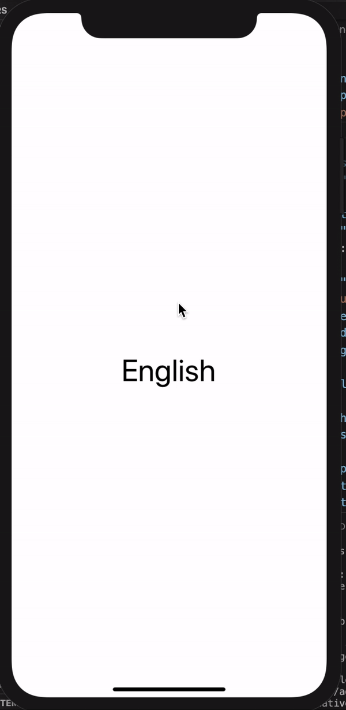

<h1 align="center">
  🚩 Language-Provider
</h1>

<div align="center">

Wrapper of Context for Language.

</div>

<p align="center" >
  <kbd>
    
  </kbd>
  <br>
  <em>Language-Provider example app.</em>
</p>

## Usage

**Note: You must be using React Native 0.60.0 or higher to use the most recent version of `@rabiloo/react-native-language-provider`.**

Install AsyncStorage:
### Follow [react-native-community/async-storage](https://github.com/react-native-community/async-storage)
Install react-native-localize:
### Follow [react-native-localize](https://github.com/react-native-community/react-native-localize)
<br>

```bash
yarn add @rabiloo/react-native-language-provider
```
OR FROM GIT
```bash
yarn add https://github.com/rabiloo/react-native-language-provider.git
```

```jsx
- Step 1: Wrapper your App Root 

import {LanguageContainer} from '@rabiloo/react-native-language-provider';

const App = () => (
    <LanguageContainer
      cache={true}
      data={{
        en: {
          title: 'English',
        },
        vi: {
          title: 'Tiếng Việt',
        },
      }}
      initialLanguageCode={'en'}>
      <Demo />
    </LanguageContainer>
)
```

```jsx
- Step 2: use useLanguageString hook to get Strings data

import {
  useLanguageString,
  LanguageService,
} from '@rabiloo/react-native-language-provider';

const Demo = () => {
  const {Strings, setLanguageCode} = useLanguageString();

  return (
      <View
        style={{
          flex:1,
        }}>
        <Text
          style={{ fontSize: 40}}
          onPress={() => {
            //your current language code
            const currentLanguageCode = LanguageService.getLanguageCode();
            
            //set to new language code, all app will be updated
            setLanguageCode({
              languageCode: currentLanguageCode === 'en' ? 'vi' : 'en',
            });
          }}>
          {Strings.title}
        </Text>
      </View>
  );
};

```
## Properties

### `data?: object`

Source for App Language.e.g. 
```js
data={{
        en: {
          title: 'English',
        },
        vi: {
          title: 'Tiếng Việt',
        },
      }}
```    
---
### `cache?: boolean`
Save your current language code to AsyncStorage
```js
en, vi....based on your define
```  
---
## Supported React Native Versions

This project only aims to support the latest version of React Native.\
This simplifies the development and the testing of the project.

If you require new features or bug fixes for older versions you can fork this project.


## Licenses
MIT